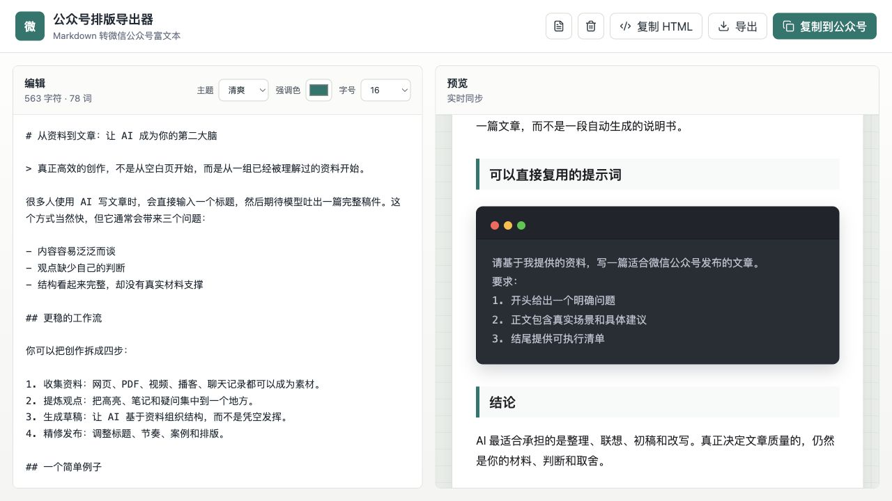

<div align="center">

# 文桥 PostBridge

**用 Markdown 写作，适配公众号、小红书长文和抖音文章。**

一份 Markdown，适配多个内容平台的文章编辑器。

**简体中文** · [English](README.en.md)

**[在线体验](https://postbridge-rho.vercel.app)**

`Markdown → 文章适配 → 微信公众号 / 小红书长文 / 抖音文章`

</div>



<p align="center"><sub>早期版本界面预览，当前界面以在线版本为准。</sub></p>

---

## 这是什么？

**文桥 PostBridge** 是一个在浏览器中运行的 Markdown 排版工具，适合公众号作者、技术博主，以及习惯用 Markdown 写文章的创作者。

把文章粘贴进编辑区，调整主题、强调色和字号，即可实时查看排版效果，再将富文本复制到微信公众号编辑器。PostBridge 将样式写入 HTML 元素的内联样式，帮助粘贴后的内容保留排版，减少重复调整标题、引用、表格和代码块的工作。

**在线地址：[https://postbridge-rho.vercel.app](https://postbridge-rho.vercel.app)**

当前支持微信公众号、小红书原生「写长文」和抖音「发布文章」的内容准备、复制与导出。发布文章由你在对应平台后台完成。

## 能做什么？

| 功能 | 说明 |
| --- | --- |
| 实时预览 | 左侧编辑 Markdown，右侧同步查看效果，附字符与词数统计 |
| 长文模式 | 小红书长文、抖音文章：正文复制与结构预览，代码块与公众号使用同一样式 |
| 三种主题 | 公众号模式提供清爽、杂志、技术，搭配自定义强调色与 15–18 px 字号 |
| 常用文章元素 | 标题、列表、引用、链接、图片、表格、行内代码和代码块 |
| 公众号富文本 | 点击「复制到公众号」，再粘贴到公众号正文编辑器 |
| 代码块展示 | 可复制的横向滚动代码，或在复制富文本时转成图片 |
| HTML 输出 | 按当前平台复制正文 HTML，或下载包含标题的完整 `.html` 文件 |
| 浏览器内处理 | Markdown 解析、排版和代码图片生成均在浏览器中完成，无需账号或后端服务 |

## 如何使用？

1. 打开 **[在线体验](https://postbridge-rho.vercel.app)**。
2. 在左侧粘贴或编写 Markdown，也可以点击顶部文档图标载入示例。
3. 选择主题、强调色、字号和代码模式，在右侧检查排版。
4. 点击 **「复制到公众号」**，粘贴到微信公众号后台的正文编辑器。
5. 在公众号后台检查最终效果，确认图片、链接等内容后发布。

需要 HTML 时，可直接使用顶部的 **「复制 HTML」** 或 **「导出」**。

## 小红书长文与抖音文章

在顶部选择 **小红书长文** 或 **抖音文章**，右侧直接预览正文。开头的一级标题会提取为文章标题，标题在平台中填写。表格转为逐项文字，外链保留地址。代码块沿用公众号的深色卡片、三色圆点与等宽字体。

### 多代码块：文章包与导入助手（实验版）

文章包包含正文、代码 PNG、可读取的正文配图及图片位置，供配套助手使用，平台本身不能直接打开。

1. 按[安装说明](extension/README.md)在 Chrome 加载项目的 `extension` 文件夹，并固定助手图标。只需安装一次。
2. 在文桥选择目标平台，点击 **「导出文章包」**。
3. 打开对应平台的空白长文正文编辑器，点击 **「文桥长文导入助手」**。
4. 选择下载的 `.postbridge.json`，点击 **「开始导入」**。助手按原文顺序上传并插入图片。
5. 等待完成，检查排版并填写标题、封面等信息，再自行发布。

已有正文时，助手需要勾选“追加”才会写入末尾。每包最多 100 张图片、32 MB；远程配图需要允许跨站读取。上传超时会停止后续上传，请先核对结果再操作。助手只在点击后访问当前平台页面，图片通过平台自身上传逻辑处理。

**更新助手：** 在 Chrome 扩展管理页点击助手的重新加载，关闭旧导入面板，再次点击助手图标。0.1.1 修复了小红书重复上传、图片错位和位置标记残留；旧文章包可以继续使用，已导入的旧稿不会自动修复。

### 直接复制正文或单张图片

点击 **「复制长文正文／复制文章正文」** 可粘贴文字与基础结构。此路径将代码保留为普通文字段落，避免平台过滤内嵌图片后丢失代码。顶部 **「代码图片」** 提供逐张复制 PNG 与下载，适合少量图片。

公众号的 **「代码 → 图片」** 在复制整篇富文本时转换代码块；预览、复制 HTML 与导出 HTML 保留文本代码卡片。

### 验证范围

2026-09-13 在 macOS Chrome 中验证了文章包导出，以及小红书三张代码图片的批量导入：图片各上传一次、顺序正确、位置标记清理完成、图片加载成功，原有正文保持完整。抖音批量导入效果已获用户反馈确认。助手依赖平台当前编辑器接口，仍作为实验功能提供，平台更新后可能需要适配。

## 使用说明

- **保存原稿：** 当前没有草稿自动保存功能，刷新页面会重新载入示例。请另行保存 Markdown 原稿。
- **代码图片：**公众号「图片」模式用于富文本正文复制；小红书与抖音可通过文章包批量导入，也可逐张复制或下载。实时预览、复制 HTML 和导出 HTML 保留文本代码块。
- **粘贴效果：** 微信编辑器可能调整样式或处理图片，最终效果以粘贴后的预览为准。
- **剪贴板：** 在线版使用 HTTPS；本地可通过开发服务器访问。复制时可能需要浏览器授予剪贴板权限。
- **远程图片：** 文章转换在浏览器内完成；Markdown 中引用的远程图片仍会向相应图片地址发起请求。

## 本地开发

准备好 Node.js 和 npm，然后运行：

```bash
git clone https://github.com/ShimenTian/postbridge.git
cd postbridge
npm install
npm run dev
```

打开终端显示的本地地址，默认是 `http://127.0.0.1:5173`。

```bash
# 构建生产版本，输出到 dist/
npm run build

# 本地预览构建结果
npm run preview
```

项目是纯前端静态应用，可将 `dist/` 部署到 Vercel 等静态托管服务，无需配置后端或 API 密钥。

## 技术与结构

使用 **Vite + 原生 JavaScript + CSS** 构建，**Marked** 解析 Markdown，**DOMPurify** 清理生成的 HTML，**Lucide** 提供界面图标，**Canvas** 生成代码块图片。

```text
postbridge/
├── docs/preview.png   # 项目预览图
├── src/main.js        # 编辑、转换、主题与导出逻辑
├── src/platforms.js   # 平台配置、长文结构与纯文本转换
├── src/import-package.js # 正文、图片与位置打包
├── extension/         # Chrome 长文导入助手与安装说明
├── src/styles.css     # 界面样式
├── index.html         # 页面入口
└── package.json       # 依赖与开发命令
```

问题反馈与功能建议欢迎提交到 **[GitHub Issues](https://github.com/ShimenTian/postbridge/issues)**。
